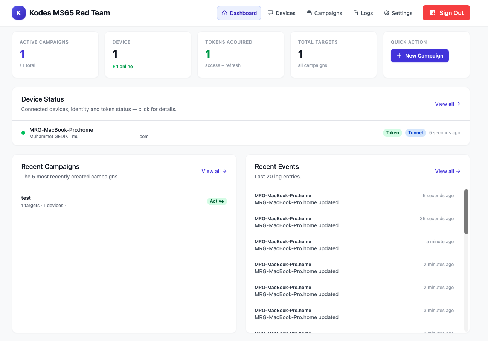
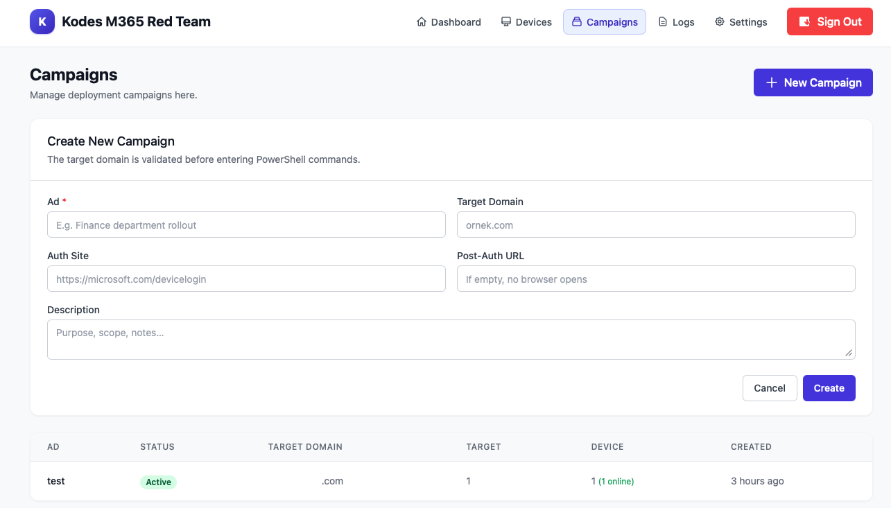
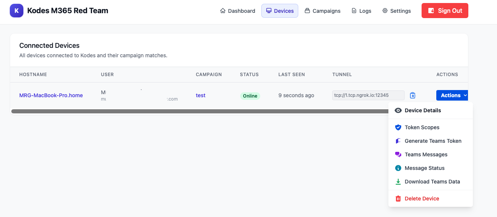
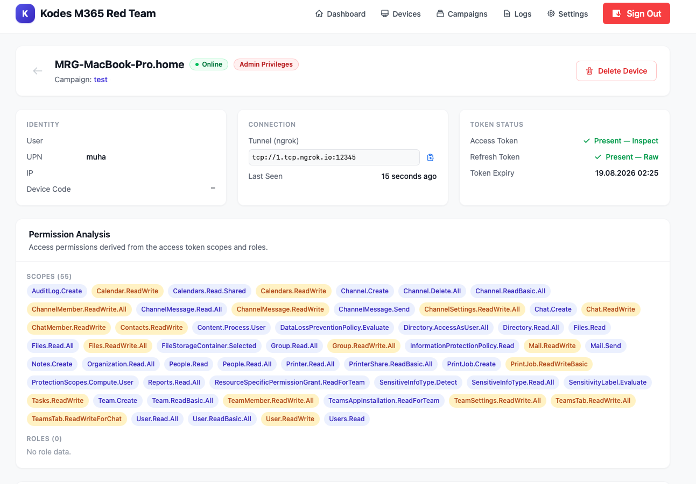
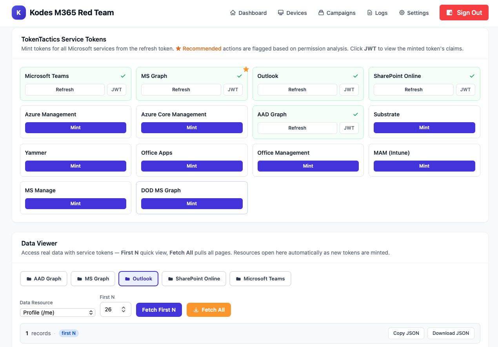
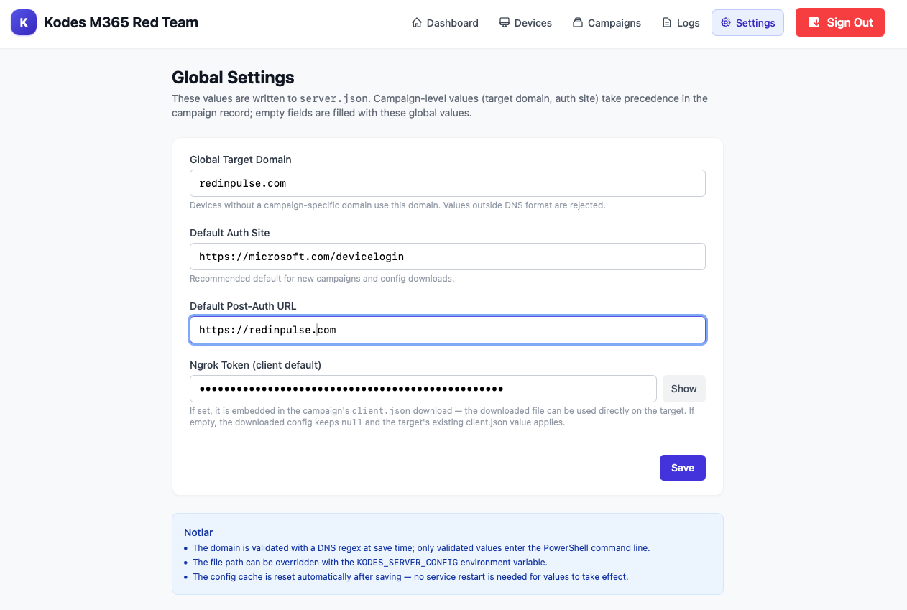
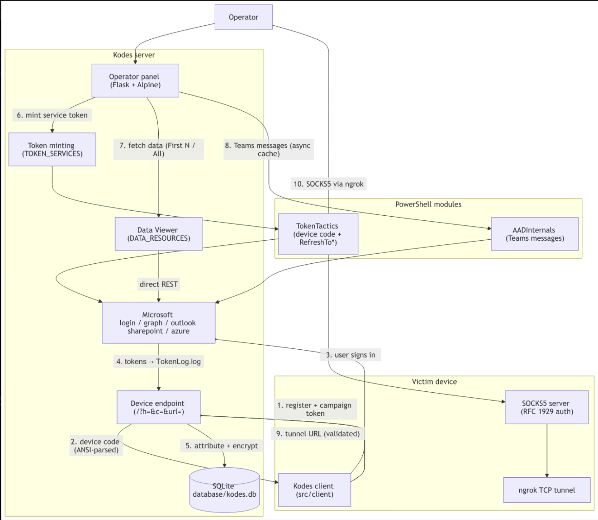
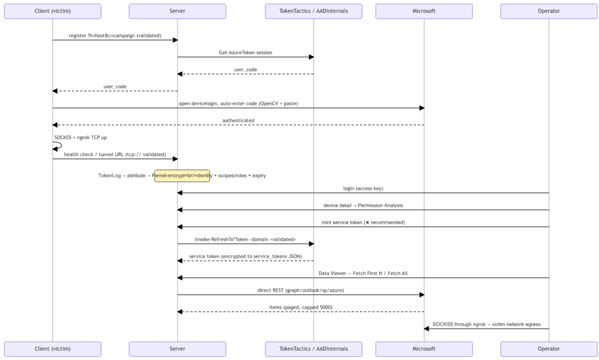

# RinP Kodes M365 Red Team

> **RinP-Kodes-M365-Stealer** · by **Red in Pulse — Mr.Gedik**

Kodes is a Microsoft 365 red-team platform that combines device-code phishing,
token harvesting, service token minting, data collection and a SOCKS5 reverse
tunnel into a single operator panel.

```
victim device ──► Kodes client ──► device-code login ──► tokens captured
                                                        │
operator ──► web panel ◄──────── Kodes server ◄─────────┘
                │                   │
                │                   ├─ TokenTactics  ──► 14 service tokens
                │                   ├─ direct REST    ──► mail / directory / sites / chats
                │                   └─ ngrok TCP      ──► SOCKS5 pivot to victim LAN
```

## What it does

1. **Device-code phishing**: the client requests a Microsoft device code,
   opens `microsoft.com/devicelogin` and auto-enters the code (image
   recognition via OpenCV, `Cmd+V` / `Ctrl+V` platform aware).
2. **Token harvesting**: the server captures the resulting access + refresh
   tokens with TokenTactics, decrypts identity claims (name, UPN, IP, scopes,
   roles) and stores everything Fernet-encrypted.
3. **Campaign management**: campaigns with target lists, bulk
   import, per-campaign target domain and downloadable per-campaign
   `client.json`.
4. **Service token minting**: one click refresh-token → token for
   **14 Microsoft services** (Teams, MS Graph, Outlook, SharePoint Online,
   Azure Management, Azure Core, AAD Graph, Substrate, Yammer, Office Apps,
   Office Management, MAM, MS Manage, DOD Graph).
5. **Data Viewer**: pull real data straight from Microsoft APIs: mail,
   directory users, groups, calendar, OneDrive, Teams chats, SharePoint sites,
   Azure subscriptions. **Fetch First N** for a quick look, **Fetch All** to
   page through everything. Any token can be inspected as raw JWT + claims.
6. **Reverse tunnel**: a SOCKS5 server on the victim with ngrok TCP tunnel;
   the public endpoint is registered to the panel automatically (tested
   end-to-end: traffic exits the victim network, credentials enforced).
7. **Hardened surface**: strict ingress validation (hostname / tunnel URL),
   sink-side domain validation before any PowerShell call, escaped render
   paths, security headers.

## Quick start

```bash
# server (local dev)
cd kodes
python -m venv .venv && source .venv/bin/activate
pip install -r requirements.txt
python -m src.main server            # http://localhost:9000

# server (docker)
docker compose up -d --build         # port 9000, persistent ./database

# client
python -m src.main client -c client.json
```

First launch prints the admin access key; it is also written to
`config/secret.key`. Log in at `/login`.

Detailed guides: [docs/INSTALLATION.md](docs/INSTALLATION.md) ·
[docs/USER_GUIDE.md](docs/USER_GUIDE.md) ·
[docs/DEVELOPMENT.md](docs/DEVELOPMENT.md) ·
[docs/SECURITY.md](docs/SECURITY.md) ·
[docs/FAQ.md](docs/FAQ.md)

## Panel at a glance

| Page | Purpose |
|---|---|
| Dashboard | Stats, device status feed, recent campaigns, event log |
| Devices | All devices, tunnel column, per-device action menu |
| Device detail | Identity, connection, token status, **Permission Analysis** (scopes/roles chips), **TokenTactics service tokens** (★ = recommended from permission analysis), **Data Viewer**, device logs |
| Campaigns | CRUD, targets, bulk import, launch/complete, deployment config |
| Settings | Global target domain, default auth/post-auth URLs, ngrok token |
| Logs | Paginated, searchable event stream |

## Screenshots

> Captured in a lab environment with test accounts; target domains are
> masked.

| Dashboard | Campaigns |
|---|---|
|  |  |

| Devices | Device detail: Permission Analysis |
|---|---|
|  |  |

| Data Viewer | Settings |
|---|---|
|  |  |

Architecture: component graph and end-to-end flow (rendered from
[docs/flow-diagram.md](docs/flow-diagram.md)):





## References & credits

The token techniques in this platform are built on the research and tooling
of the projects below. Read them; the phishing concepts, client-ID selection
and refresh-token flows used here come directly from this work.

- **AADInternals**: <https://github.com/Gerenios/AADInternals>
  (Teams message access via `Get-AADIntTeamsMessages` and the wider
  Azure AD / M365 attack-toolkit this platform leans on)
- **AADInternals phishing research**: <https://aadinternals.com/post/phishing/>
  (device-code and token-replay phishing background)
- **TokenTactics**: <https://github.com/rvrsh3ll/TokenTactics>
  (refresh-token → per-service token minting; the
  `Invoke-RefreshTo*Token` family used by the service-token panel)
- Vendored `TokenTactics` module (v0.0.2, Stephan Borosh & Bobby Cooke)
  ships in [`tokentactics/`](tokentactics/), `AADInternals` in
  [`aadinternals/`](aadinternals/).

## Operational notes

- Authorized security testing only; use against tenants you have written
  permission to test.
- ngrok TCP endpoints require account verification (card on file, not
  charged), otherwise `ERR_NGROK_8013`.
- The campaign target domain must be the victim tenant's real domain; a
  foreign domain yields `AADSTS50020` at mint time.
- Windows client builds: `pyinstaller build/client_build.spec` (DPI-aware,
  template image bundled, see [docs/INSTALLATION.md](docs/INSTALLATION.md)).

## Disclaimer

This platform is published for **educational purposes**: use it as training
material in red-team coursework, labs and controlled environments only. It
must **not be tested or deployed against real systems, production tenants or
real users** without explicit written authorization. The authors accept no
liability for any misuse. This MIT license covers the `kodes/` platform code;
the vendored [`tokentactics/`](tokentactics/) and
[`aadinternals/`](aadinternals/) modules retain their own upstream licenses.

---

Built by **Red in Pulse — Mr.Gedik**
