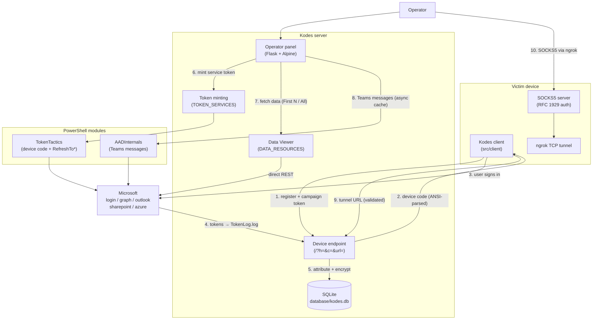
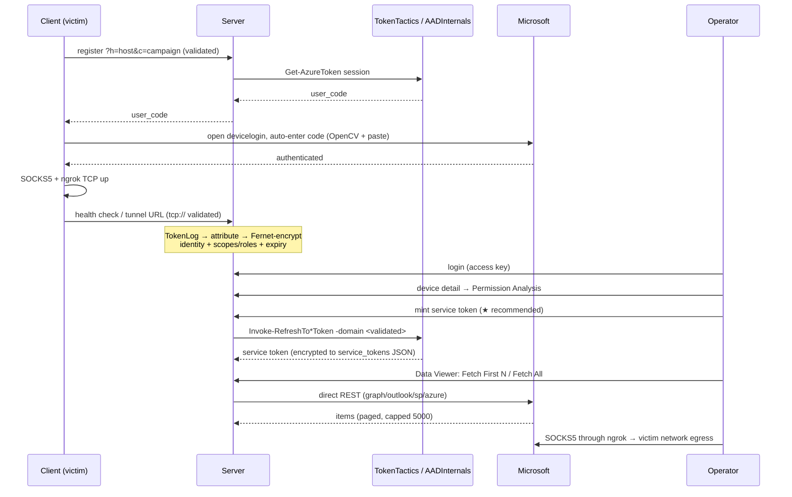

# Kodes M365 Red Team End-to-End Flow

## Component graph

## Registration-to-pivot sequence

## References

- AADInternals: <https://github.com/Gerenios/AADInternals>
- AADInternals phishing: <https://aadinternals.com/post/phishing/>
- TokenTactics: <https://github.com/rvrsh3ll/TokenTactics> (vendored, v0.0.2)
